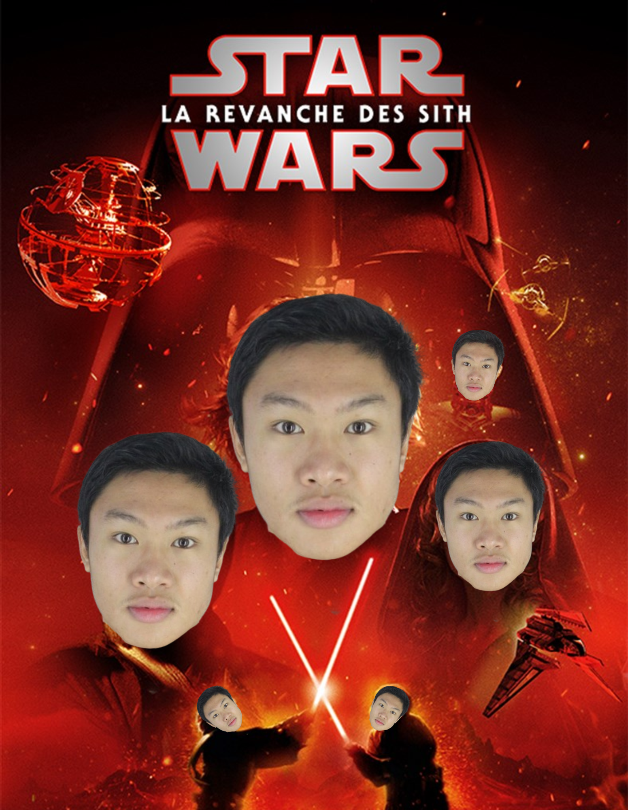

# 👨‍💻 Robin HILAIRE: FullStack-Entwickler

  <a href="README.md">🇬🇧</a>
  <a href="README.fra.md">🇫🇷</a>
  <a href="README.deu.md">🇩🇪</a>
  <a href="README.esp.md">🇪🇸</a>
  <a href="README.rus.md">🇷🇺</a>
  <a href="README.jpn.md">🇯🇵</a>
  <a href="README.chn.md">🇨🇳</a>
  <a href="README.kor.md">🇰🇷</a>

## 👋 Willkommen!

Als leidenschaftlicher FullStack-Entwickler erstelle ich moderne Web- und Software-Anwendungen und richte robuste Infrastrukturen ein. Meine Fähigkeiten reichen von Frontend- und Backend-Entwicklung mit React/Javascript oder Qt/C++ bis hin zur Linux-Systemadministration, was mir ermöglicht, eine vollständige DevOps-Vision der Projekte zu haben, an denen ich arbeite.

### 🚀 Was ich mache

- Entwicklung leistungsstarker und skalierbarer Web- und Software-Anwendungen
- Erstellung moderner Benutzeroberflächen mit React
- Konfiguration und Wartung von Linux-Servern
- Entwicklung von End-to-End technischen Lösungen
- Cross-Plattform-Entwicklung (Web, Desktop, Mobile)

### 💡 Was mich auszeichnet

- Technische Vielseitigkeit: vom Frontend bis zum Backend, einschließlich DevOps und Systemadministration
- Leidenschaft für Open-Source und moderne Technologien
- Ständiges Streben nach Verbesserung und Optimierung
- Gute Anpassungsfähigkeit an neue Tools und Frameworks
- Interesse am Wissensaustausch

### 🤝 Zusammenarbeit

Fühlen Sie sich frei, meine Projekte zu erkunden oder mich zu kontaktieren, um über mögliche Zusammenarbeiten zu sprechen!

## 🛠️ Fähigkeiten

- **Programmiersprachen:** C / C++, JavaScript, Typescript, Python, Java, PHP, HTML, CSS
- **Frameworks:** React, Ionic, Laravel, Angular, Qt / PyQt, JavaSwing
- **CSS-Frameworks:** TailwindCSS, Bootstrap, Boosted
- **Datenbanken:** MariaDB / MySQL, PostgreSQL, MongoDB
- **IDEs:** Cursor, VS / VSCode, NetBeans, QtCreator, IntelliJ
- **Tools:** Git, Docker, Vite, NPM, WebPack
- **Betriebssysteme:** Linux, Windows, MacOS (🤮)
- **Systemadministration:** Linux (Rocky, Debian, Ubuntu), Apache2, Nginx, Caddy, Certbot, Keycloak, etc...

## 🌈 Hobbies

- **Manavana Wars:** Ich bin ein riesiger Fan der Filme Manavana Wars, insbesondere des 3. Teils, Die Rache der Manavanana. Die Schauspielerei ist verrückt, die Geschichte, obwohl sinnlos, ist bewundernswert, ich empfehle sie mit geschlossenen Augen !

