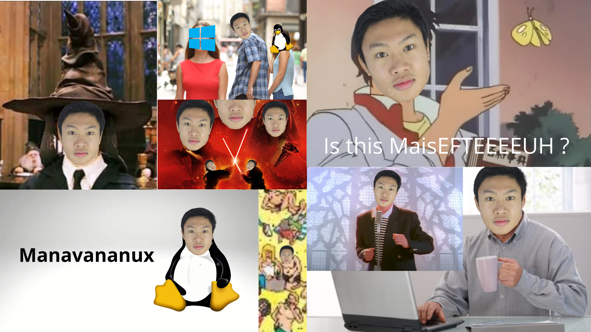

# 👨‍💻 Robin HILAIRE : Développeur FullStack

  <a href="README.md">🇬🇧</a>
  <a href="README.fra.md">🇫🇷</a>
  <a href="README.deu.md">🇩🇪</a>
  <a href="README.esp.md">🇪🇸</a>
  <a href="README.rus.md">🇷🇺</a>
  <a href="README.jpn.md">🇯🇵</a>
  <a href="README.chn.md">🇨🇳</a>
  <a href="README.kor.md">🇰🇷</a>

## 👋 Bienvenue !

Développeur FullStack passionné, je crée des applications web et logicielles modernes et mets en place des infrastructures solides. Mes compétences s'étendent du développement frontend et backend avec React/Javascipt, ou encore Qt/C++, jusqu'à l'administration système Linux, ce qui me permet d'avoir une vision de DevOps complète des projets sur lesquels je travaille.

### 🚀 Ce que je fais

- Développement d'applications web et logicielles performantes et évolutives
- Création d'interfaces utilisateur modernes avec React
- Configuration et maintenance de serveurs Linux
- Conception de solutions techniques de bout en bout
- Développement cross-platform (web, desktop, mobile)

### 💡 Ce qui me caractérise

- Polyvalence technique : du frontend au backend, en passant par le DevOps et l'administration système
- Passion pour l'open-source et les technologies modernes
- Recherche constante d'amélioration et d'optimisation
- Bonne capacité d'adaptation aux nouveaux outils et frameworks
- Intérêt pour le partage de connaissances

### 🤝 Collaboration

N'hésitez pas à explorer mes projets ou à me contacter pour échanger sur d'éventuelles collaborations !

## 🛠️ Compétences

- **Langages :** C / C++, JavaScript, Typescript, Python, Java, PHP, HTML, CSS
- **Frameworks :** React, Ionic, Laravel, Angular, Qt / PyQt, JavaSwing
- **Frameworks CSS :** TailwindCSS, Bootstrap, Boosted
- **Bases de données :** MariaDB / MySQL, PostgreSQL, MongoDB
- **IDEs :** Cursor, VS / VSCode, NetBeans, QtCreator, IntelliJ
- **Outils :** Git, Docker, Vite, NPM, WebPack
- **Systèmes d'exploitation :** Linux, Windows, MacOS (🤮)
- **Admin système :** Linux (Rocky, Debian, Ubuntu), Apache2, Nginx, Caddy, Certbot, Keycloak, etc...

## 🌈 Loisirs

- **Saga Manavanana:** Je suis un grand fan de la saga manavanana, désormais traduite en toutes les langues et qui me permet de m'évader du quotidien trop banalalilala (comme Mastu lol mdr xptdrrr xd), bref... Un manavananesque plaisir.

