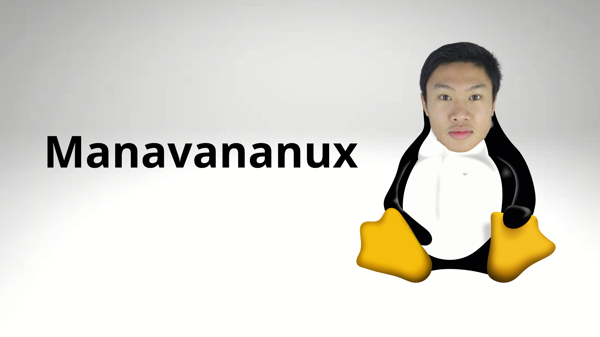

# 👨‍💻 Robin HILAIRE: FullStack Developer

  <a href="README.md">🇬🇧</a>
  <a href="README.fra.md">🇫🇷</a>
  <a href="README.deu.md">🇩🇪</a>
  <a href="README.esp.md">🇪🇸</a>
  <a href="README.rus.md">🇷🇺</a>
  <a href="README.jpn.md">🇯🇵</a>
  <a href="README.chn.md">🇨🇳</a>
  <a href="README.kor.md">🇰🇷</a>

## 👋 Welcome!

As a passionate FullStack developer, I create modern web and software applications and set up robust infrastructures. My skills range from frontend and backend development with React/Javascript, or Qt/C++, to Linux system administration, allowing me to have a complete DevOps vision of the projects I work on.

### 🚀 What I Do

- Development of high-performance and scalable web and software applications
- Creation of modern user interfaces with React
- Configuration and maintenance of Linux servers
- Design of end-to-end technical solutions
- Cross-platform development (web, desktop, mobile)

### 💡 What Characterizes Me

- Technical versatility: from frontend to backend, including DevOps and system administration
- Passion for open-source and modern technologies
- Constant pursuit of improvement and optimization
- Good adaptability to new tools and frameworks
- Interest in knowledge sharing

### 🤝 Collaboration

Feel free to explore my projects or contact me to discuss potential collaborations!

## 🛠️ Skills

- **Languages:** C / C++, JavaScript, Typescript, Python, Java, PHP, HTML, CSS
- **Frameworks:** React, Ionic, Laravel, Angular, Qt / PyQt, JavaSwing
- **CSS Frameworks:** TailwindCSS, Bootstrap, Boosted
- **Databases:** MariaDB / MySQL, PostgreSQL, MongoDB
- **IDEs:** Cursor, VS / VSCode, NetBeans, QtCreator, IntelliJ
- **Tools:** Git, Docker, Vite, NPM, WebPack
- **Operating Systems:** Linux, Windows, MacOS (🤮)
- **System Administration:** Linux (Rocky, Debian, Ubuntu), Apache2, Nginx, Caddy, Certbot, Keycloak, etc...

## 🌈 Hobbies

- **Manavananux:** I am an expert and a maintainer of this very new distribution, which, although complex, remains at the forefront of modernity and revolutionizes the use of a computer.

